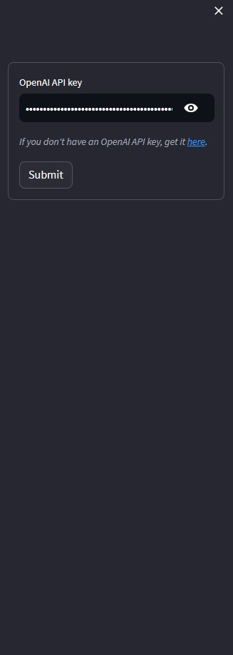

# StoryCraft-AI-App
Develop an Ai Application to generate video games storyline as well the  image visual based on the generate storyline.

# Overview
This project uses OpenAi's GPT-3.5 Model to generate to storyline, the image description as well as the language output for the storyline. 
Apart from that this app also use Stable Diffusion XL to generate image based on the generated image description. 
This app also need to run on really good gpu due to the requirement to run Stable Diffusion XL. Hence, I run this app on `Google Colab`.

# Requirements
- Python 3.9.17
- openai
- diffusers >= 0.19.0
- invisible_watermark
- transformers
- accelerate
- safetensors
- torch
- streamlit
- stqdm
- OPEN AI's API KEY

# Installation 
- Clone this repository.
- Install the required dependencies.
- Run on `Google Colab`.

# Results
To ease, user are encouraged to upload the `StoryCraft_AI.ipynb` into the `Google Colab`. After than change the runtime type to `GPU`. 
After installed all the dependencies, user needed to key in their own `OpenAI API KEY`. The app will give a warning if the key is invalid.

  

Then, user can input their prompt into the `input your idea` section and choose the output language as shown below:

  

The example output for the storyline:

  

The image generated based on the storyline:

  

# Limitation
- This app cant be upload to cloud (it can but it might be pricey).
- User has slim chances to accidentaly change the code which may resulting an error.
- Daily runtime that has been set in `Google Colab` to run the code using virtual GPUs.

# ENJOY ~

